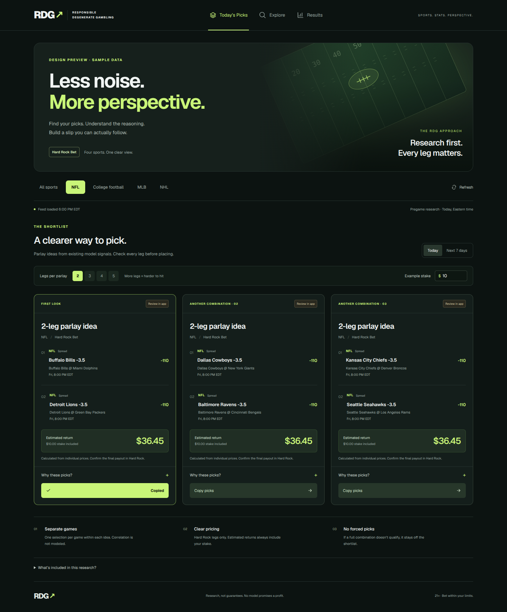

# RDG redesign and engine review

This branch is a review draft. It replaces the crowded homepage with Today’s Picks, Explore, and Results. Existing API routes, scheduled jobs, and database writes are unchanged. It is not a validated new prediction model.

## User experience

- NFL is the default. Other sports load when selected; All sports loads all four.
- The date range defaults to today in America/New_York, with an explicit next-seven-days option. Started games disappear as the local clock advances.
- Two to five legs per idea; only complete ideas are displayed, with no repeated pick across cards and no duplicate event within a card.
- Compact leg lists, individual odds, estimated returns including stake, expandable evidence and concerns, and clipboard copying.
- Research-only selections remain visible in Explore. College football stays research-only.
- Results loads on demand from the existing `rdg_picks` table, paginated rather than silently limited to 1,000 rows. It describes straight picks, not parlays. ROI is not shown without the required stake and settlement data.
- Accessibility includes keyboard focus states, a skip link, descriptive control labels, native expandable details, and reduced-motion support.

## Betting correctness changes

- The previous homepage selected the best player-prop price across books. The new builder requires Hard Rock Bet specifically and matches side and exact line.
- Missing, future-dated, or more-than-15-minute-old prop quote timestamps disqualify props. The age limit is an operational safeguard, not a validated optimal threshold.
- An unavailable injury feed blocks NFL props instead of implying the player is healthy. Out, doubtful, questionable, and strong role-change props are excluded. Name matching remains a limitation; canonical player IDs should replace it.
- MLB/NHL moneyline candidates require positive model-implied value at the offered price and a qualifying review signal. Negative edges are never converted to positive with an absolute value.
- NFL spreads use model review signals, not historical straight-up bucket accuracy as a cover probability. The homepage no longer markets these ideas as optimal, safest, or calibrated win probabilities.
- Every payout is an estimate from multiplying individual decimal prices. Actual Hard Rock parlay pricing, limits, void rules, and settlement may differ.
- A per-browser cache and request deduplication reduce unnecessary calls; they do not replace shared server caching. Refresh is explicit. Expired feed responses cannot create new ideas.

## What is still missing for a profit-focused engine

1. **Canonical, timestamped inputs.** Store event, team, player, market, line, price, book, quote time, injury report time, lineup status, and source IDs. Never label the HTTP receipt time as an odds timestamp. The current game feeds do not provide reliable quote timestamps to this view.
2. **Real contextual models.** Weather requires venue coordinates, game-time forecasts, indoor/roof handling, and historical forecasts available at pick time. Injury effects require snap/usage redistribution and team/player identity matching. Current injury text does not establish a quantified projection adjustment.
3. **Point-in-time evaluation.** Replay historical quotes and news using only information known before each game. Compare the existing baseline with proposed adjustments in walk-forward holdouts. Report probability calibration, log loss/Brier score, returns after vig, sample sizes, uncertainty, and drawdowns. Prediction-yard MAE alone is not evidence of betting profitability.
4. **Joint probabilities and offered parlay prices.** Avoid unsupported same-game combinations until a joint model and actual same-game parlay quote are available. Separate games do not guarantee independence. Estimate portfolio exposure across slips, too.
5. **Persistent recommendations and settlement.** Save immutable recommendation versions before games. Track singles and exact parlays independently, including stakes, actual prices, voids/pushes, and net settlement. Current saved single-pick results are insufficient for parlay ROI.
6. **Provider-backed rollout.** Confirm production payloads and configured Hard Rock coverage without exposing credentials, validate one NFL market end to end, then extend independently to CFB, MLB, and NHL. No arbitrary weather/injury multipliers should be introduced solely to make the feature list longer.

## Local verification

- `npm run build` with non-production placeholder public Supabase configuration.
- `npx tsc --noEmit`.
- Targeted ESLint for changed application and test files.
- `npm test` (Node 22.6+ with TypeScript stripping; Node 24 used locally).
- Unit cases cover odds parsing and return math, Eastern dates, started games, incomplete cards, duplicate events, wrong-book quotes, line mismatch, quote age, unavailable injury feeds, injury/role exclusions, and expired responses.

No production sportsbook calls, database writes, or live deployment were performed during local validation. Browser fixture tests, where run, verify UI behavior rather than the accuracy of provider data.

## Browser review

Passed a local production-build browser run with intercepted fixture feeds: desktop at 1440px, mobile at 390px (no horizontal overflow), stake/payout recalculation, expandable explanations, clipboard copying, search, Results, empty states, sport-specific loading, cache reuse, explicit refresh, and 15-minute expiry. No browser exceptions occurred. Screenshots below use sample data, not actual betting recommendations.

[Mobile design preview with sample data](preview-mobile.png)
